# GUIA DO MOCHILEIRO DAS GAMBIARRAS

#### Um guia básico sobre API's da Takao, sobre o que fazer em casos de problemas comuns, como debugar, etc. 

#### Não vou explicar nada em detalhes, vou apenas dar o caminho, ao debugar procurando as informações que informar, conseguirá lidar com o que precisa e entender o que está acontecendo de verdade no código.

## Placas API

Tudo o que vai precisar mexer em si fica centralizado no GetPlacaHandler ( PlacasAPI.Mediator\Placa\GetPlaca\GetPlacaHandler.cs), no método Handle. Ali, é feito uma busca na nossa base para verificar se a placa existe na nossa base.

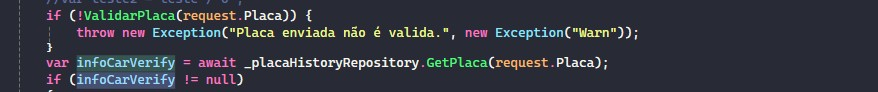

Armazenando as informações do carro no infoCarVerify, ou nulo caso não encontre nada e em seguida faz uma busca com a API da LBMInfo. Se conseguir retornar dados, salva no histórico de placas. A base do histórico de placas armazena apenas o retorno da API de consulta, não os dados de peças relacionadas ao veiculo.

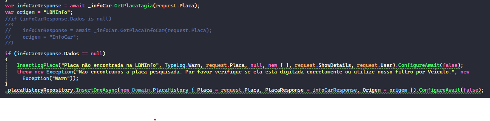

Depois disso, ele tenta converter os dados do carro para o filtro de produtos do catalogo

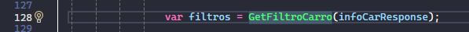

Depois disso, ele efetua a busca usando os filtros e retorna a lista de peças.

Caso encontre problemas com a API não achando o veiculo, pode ser na verdade não encontrando as peças por não conseguir criar o filtro para o catalogo apropriadamente. Seguindo o caminho dos prints e debugando o código, conseguirá entender o funcionamento principal.

Chamada principal, lembrar de usar os headers corretos
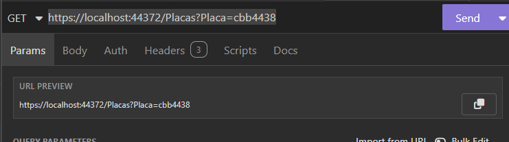
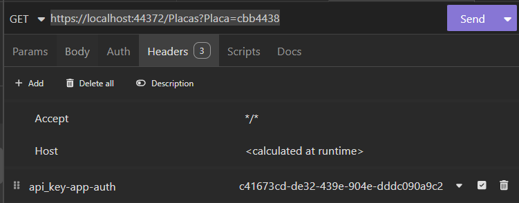

## CPFR

Há duas chamadas principais relacionadas ao CPFR/Hub. Estoque e pedidos. Primeiro sobre a de estoque que fica na EstoqueController

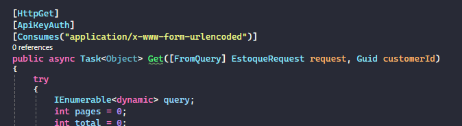

É uma simples chamada para uma proc que capta a quantidade de estoque de acordo com qualquer quantidade de SKU passados.

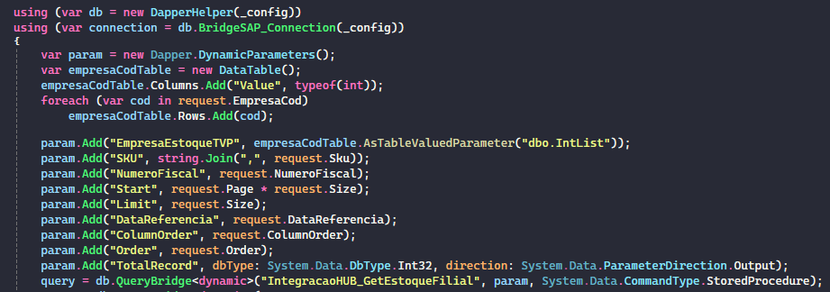

Ele monta um TVP para os códigos de empresa para também verificar multiplas empresas.

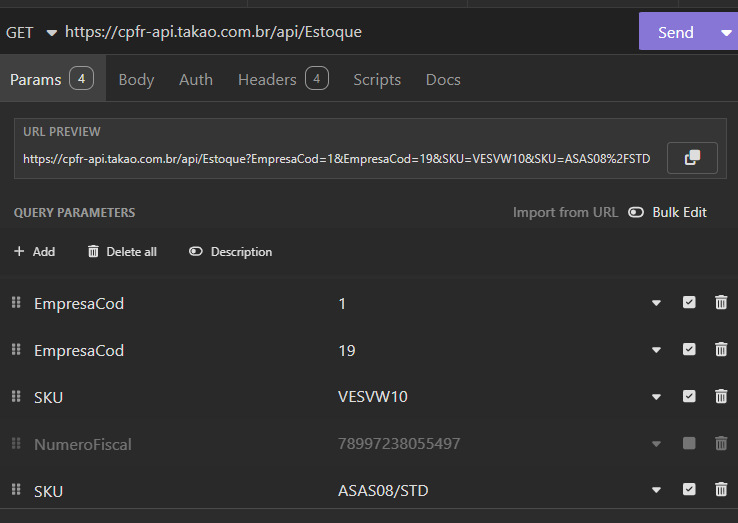
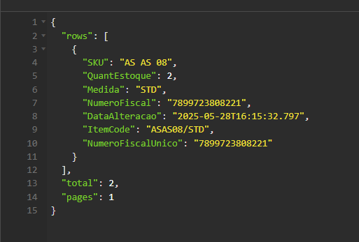

A chamada de pedidos, dentro da CustomerOrderController, através desta chamada

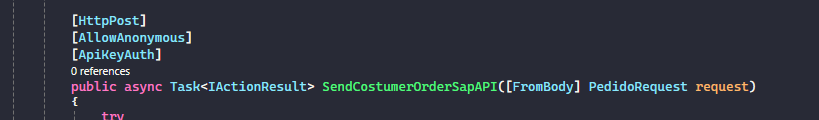
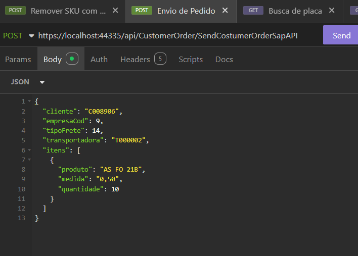
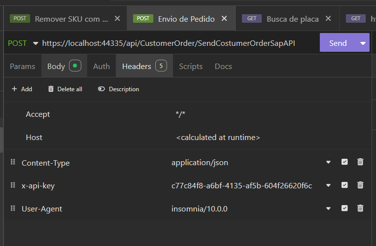

O trecho de esboço pode ser ignorado. Esta é a forma que o pedido é momentado e todos os tratamentos feitos. Vai deste jeito para o SAP.

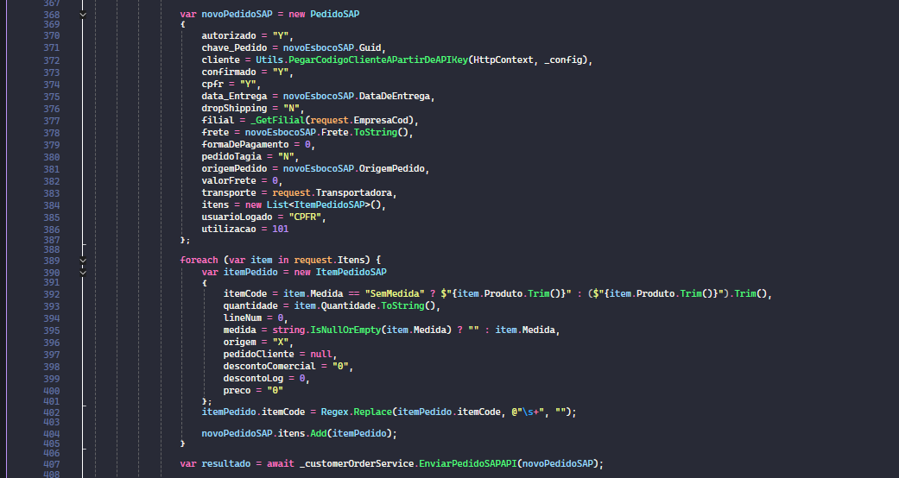

Fazendo quaisquer adaptações neste trecho dentro da chamada, poderá manipular quaisquer atualizações necessárias

#### Pontos importantes

Api-Key: Chave que é usada por clientes no catalogo
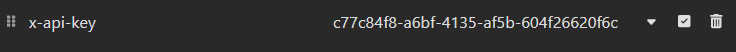
Deve sempre estar nas chamadas pois ele automaticamente identifica o usuário por aí e é importante ter o da empresa com problema no momento que for debugar

CustomerID também é preenchido a partir dele.

